# Architecture Diagrams

This document provides comprehensive visual diagrams of the FastAPI template's architecture, including system-level design, application layers, request flows, authentication patterns, and data models.

## High-Level System Architecture

The system follows a distributed architecture with clear separation between API tier, background workers, and external dependencies.

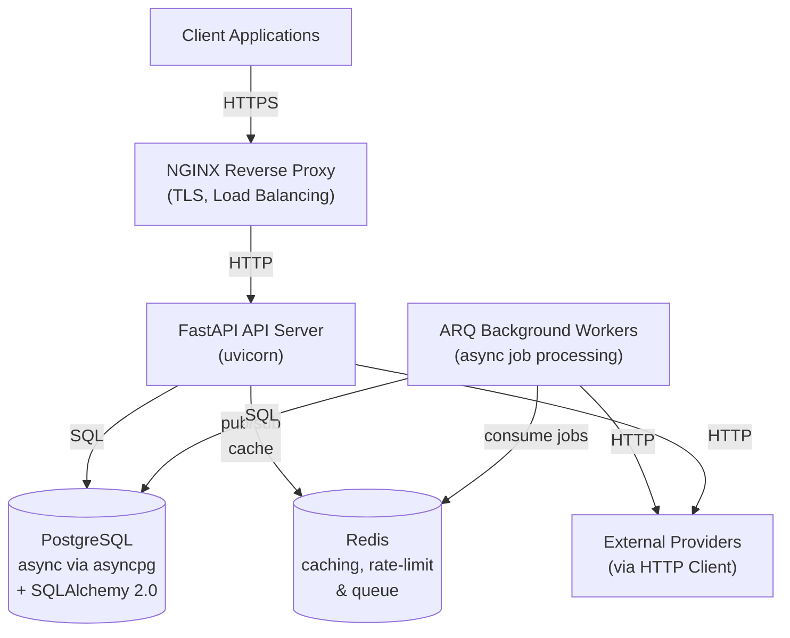

## Application Layer Architecture

The codebase is organized into logical layers, each with well-defined boundaries and dependencies. The diagram shows how data flows from routers through services to persistence.

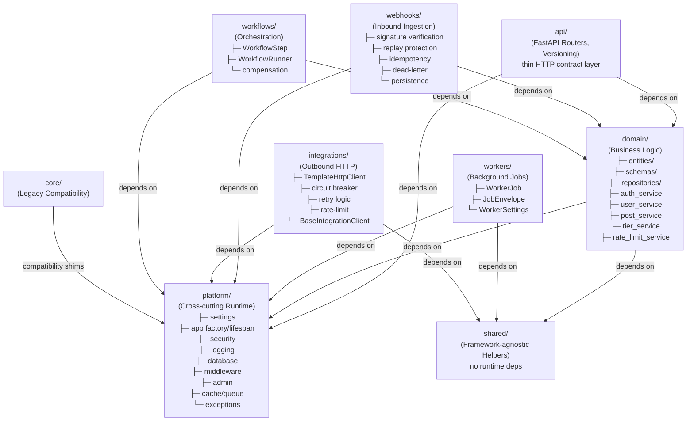

## Request Flow

A typical HTTP request travels through multiple layers, each adding value through middleware, authentication, rate limiting, and database session management.

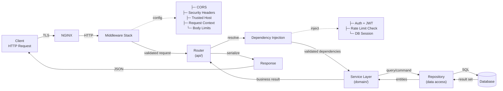

## Authentication Flow

JWT-based authentication with refresh token rotation and blacklist management ensures secure, long-lived sessions with automatic token refresh.

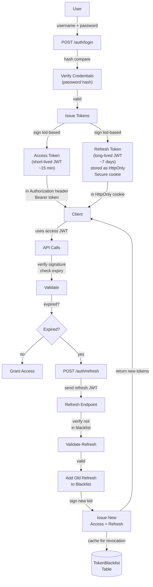

## Data Model Overview

The platform manages several key persistence tables supporting authentication, rate limiting, webhooks, workflows, and audit trails.

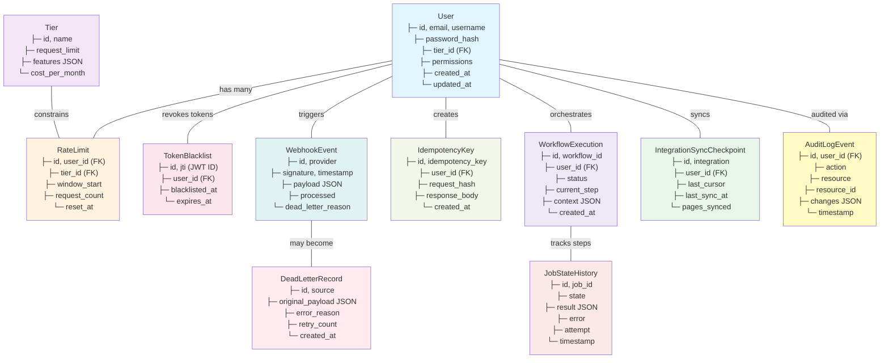

## Middleware & Security Pipeline

Request security is layered through multiple middleware components that validate, sanitize, and enrich incoming requests.

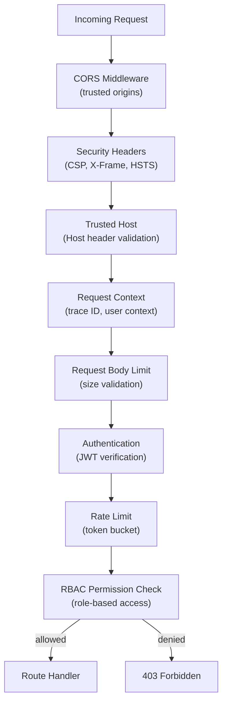

## Service & Repository Pattern

The domain layer implements a clean separation between business logic (services) and data access (repositories), with SQLAlchemy 2.0 ORM backing persistence.

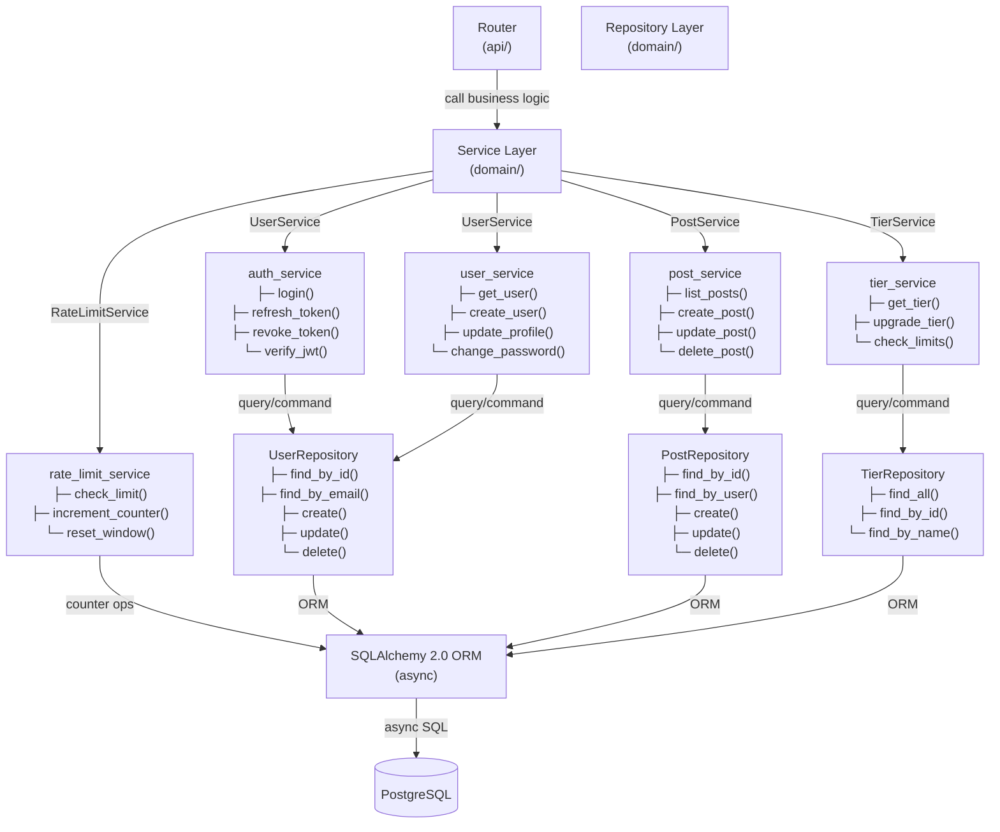

## Webhook Ingestion Pipeline

External webhooks flow through a multi-step pipeline with signature verification, replay protection, and eventual persistence.

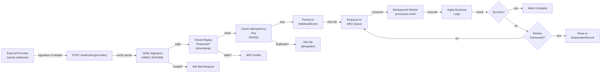

## Background Worker Architecture

ARQ workers consume jobs from Redis queues and provide durable job execution with state tracking and retry logic.

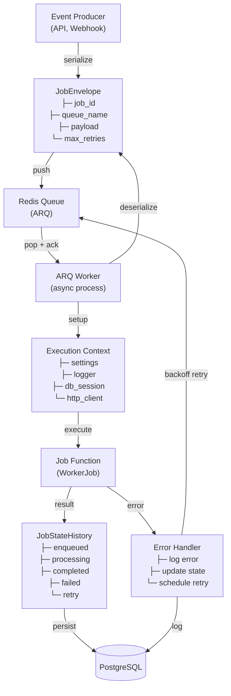

## External Integration Pattern

The TemplateHttpClient provides a resilient HTTP client for external API calls with automatic retry, circuit breaker, and rate limiting.

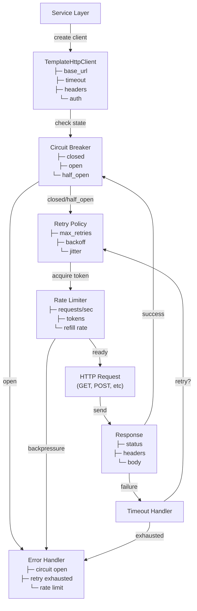

## Observability & Monitoring Stack

Optional integrations for metrics, tracing, error monitoring, and structured logging provide comprehensive observability.

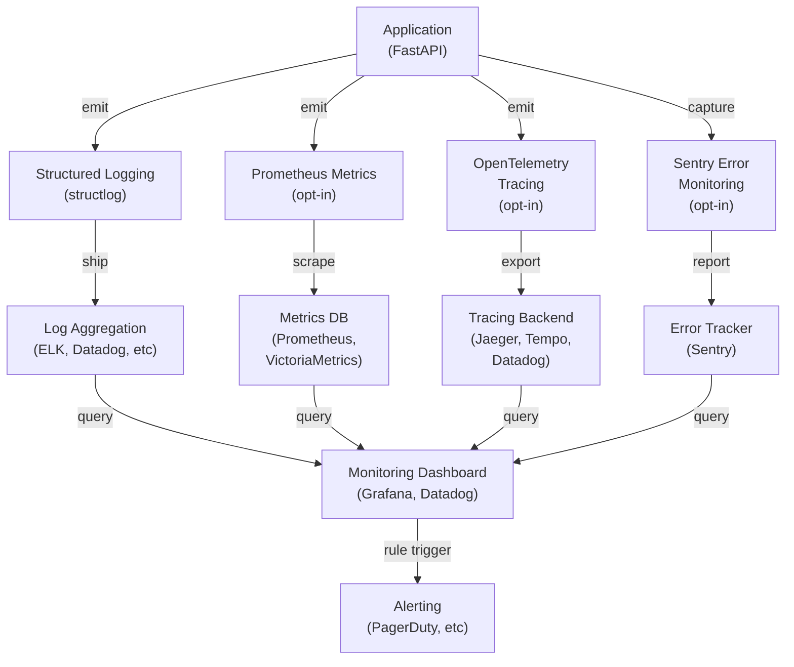

## Deployment Architecture

The application can be deployed in containerized environments with PostgreSQL and Redis as required external services.

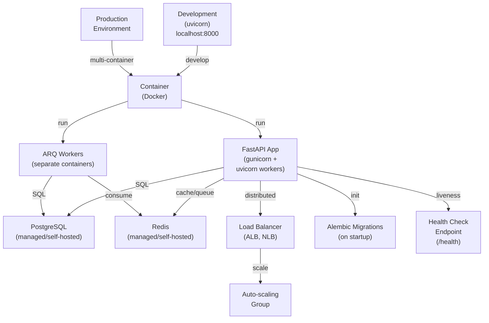

## Configuration Management

Settings flow from environment variables through a centralized Pydantic configuration model, enabling flexible deployment across environments.

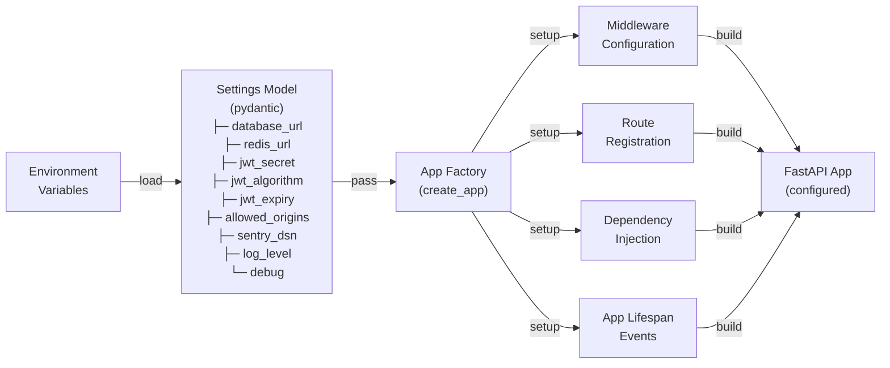

## Database Connection Lifecycle

AsyncPG with SQLAlchemy 2.0 provides high-performance async database operations with connection pooling and session management.

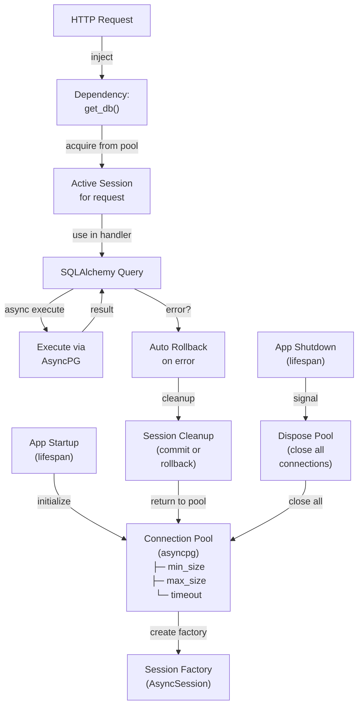

## Key Design Patterns

### Repository Pattern
All data access is abstracted behind repository interfaces, enabling testability and potential database migration without affecting business logic.

### Service Layer Pattern
Business logic lives in services that orchestrate repositories and coordinate domain operations. Services are stateless and reusable.

### Dependency Injection
FastAPI's built-in DI system injects authenticated users, rate limit info, database sessions, and other dependencies at the handler level.

### Circuit Breaker Pattern
The external HTTP client implements circuit breaker to fail fast on cascading failures from downstream services.

### Event-Driven Architecture
Webhooks and background jobs decouple time-critical API responses from long-running operations via async job queues.

### RBAC (Role-Based Access Control)
Permission checks operate at the middleware/dependency level, enforcing authorization before route handlers execute.

### Idempotency Keys
POST/PUT requests support idempotency keys to prevent duplicate side effects from retried requests.

---

**Last Updated:** 2026-04-10 | **Architecture Version:** 1.0