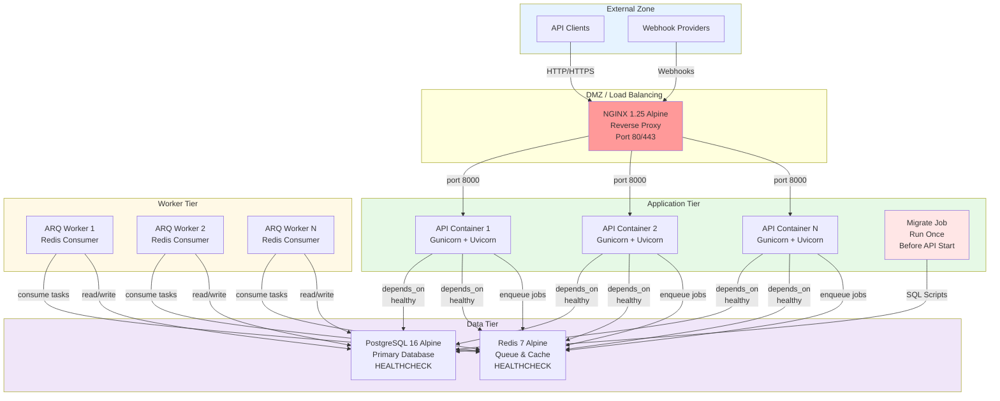
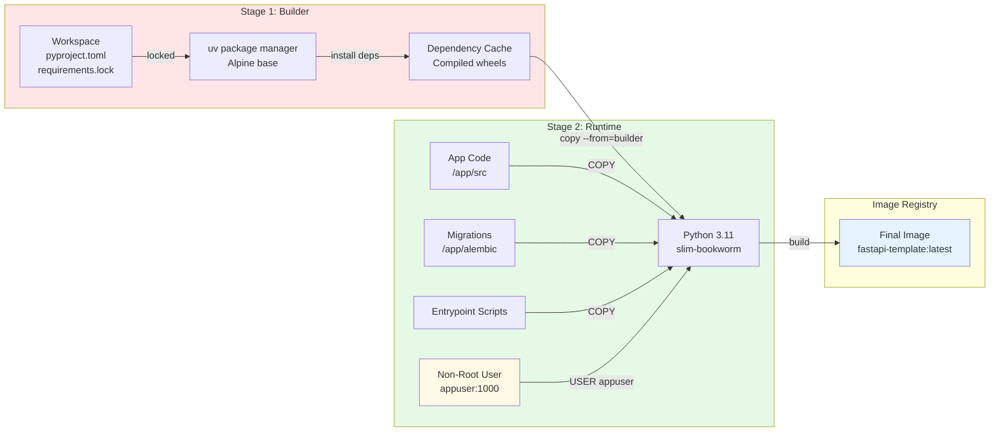
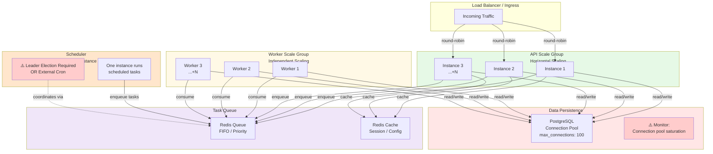
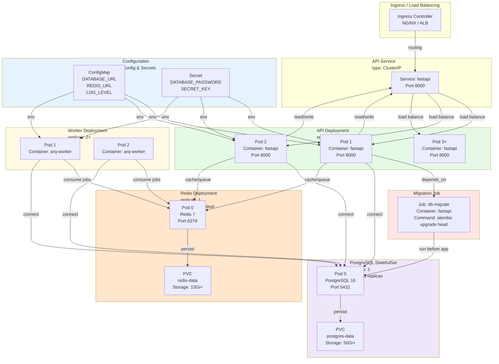
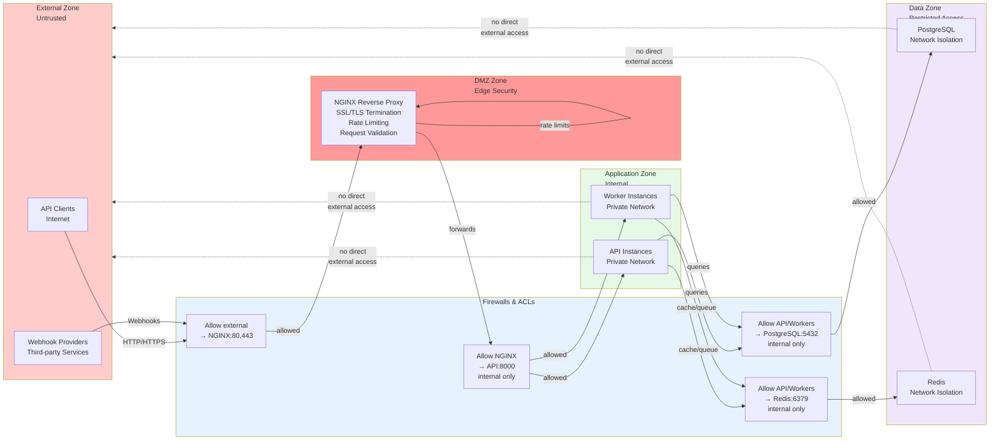

# FastAPI Template Deployment Architecture

This guide provides visual references for the three deployment profiles included in the FastAPI template: Local, Staging, and Production. Each profile is optimized for its environment while sharing a common containerized foundation.

## Overview of Profiles

- **Local**: Development environment with hot reload via Uvicorn and source volume mounts
- **Staging**: Production-like environment with Gunicorn/Uvicorn stack but no reverse proxy
- **Production**: Full production setup with NGINX reverse proxy, load balancing, and security boundaries

---

## 1. Production Deployment Topology

The production environment follows a multi-layer architecture with clear separation of concerns: external-facing reverse proxy, application tier, worker tier, and data tier.



### Production Topology Notes

- **NGINX Reverse Proxy**: Single entry point; handles SSL termination, load balancing across multiple API instances
- **Migrate Job**: Runs before any API container starts (orchestrated via `depends_on` with `condition: service_healthy`); ensures database schema is up-to-date
- **API Containers**: Multiple instances behind NGINX for horizontal scaling; each waits for PostgreSQL and Redis to be healthy before starting
- **ARQ Workers**: Consume background jobs from Redis queue; can scale independently from API tier
- **Graceful Shutdown**: All containers use `STOPSIGNAL SIGTERM` with `stop_grace_period: 30s` (API) and `60s` (workers)

---

## 2. Multi-Stage Docker Build Architecture

The template uses a two-stage Dockerfile to minimize runtime image size and improve security.



### Multi-Stage Build Details

**Stage 1: Builder (uv)**
- Uses Alpine Linux as base (minimal size)
- Installs Python dependencies via `uv`
- Generates compiled `.whl` files cached in layer
- Result: ~600MB intermediate image (discarded)

**Stage 2: Runtime**
- Python 3.11 slim-bookworm base (~150MB)
- Copies pre-built wheel cache from builder
- Copies application code (source code, migrations, scripts)
- Creates non-root `appuser` (UID 1000) for security
- Implements Python-based `HEALTHCHECK` (no external curl required)
- Sets `STOPSIGNAL SIGTERM` for graceful shutdown
- Result: ~350–400MB final production image

**Copy Strategy**
- Wheels copied at layer 3 (leverages Docker layer caching)
- App code copied at layer 4 (allows source-only rebuilds)
- Migrations copied separately (independent versioning)
- Entrypoint script included for container orchestration

---

## 3. Scaling Topology

This diagram illustrates how the template scales across different components.



### Scaling Guidelines

**API Tier**
- Scale horizontally by adding instances behind load balancer
- Each instance is stateless (sessions stored in Redis)
- Recommended: 2–10 instances for production
- Monitor: CPU, memory, request latency

**Worker Tier**
- Scale independently from API tier
- Add more workers to reduce job queue backlog
- Each worker independently consumes from Redis
- Recommended: Start with 2–4 workers; scale based on queue depth
- Monitor: Queue depth, job processing time, error rate

**PostgreSQL**
- Single primary instance (replication recommended for HA)
- Connection pooling via PgBouncer or application pool (set `max_connections` appropriately)
- Typical guidance: Allow ~20–50 connections per application instance
- Monitor: Connection count, slow queries, replication lag

**Redis**
- Single instance (Sentinel/Cluster for HA)
- Stores both task queue and cache
- Monitor: Memory usage, eviction rate, command latency

**Scheduler**
- Must run on exactly one instance
- Use distributed leader election (Redis-based or Consul-based) or external cron service
- Do NOT run scheduler in every instance without coordination
- Recommended: Deploy as separate sidecar or external service

---

## 4. Kubernetes Deployment Reference

This diagram shows how to adapt the template for Kubernetes environments.



### Kubernetes Deployment Notes

**Manifests to Create**
1. **Namespace**: `fastapi-app` (or custom)
2. **ConfigMap**: Database URL, Redis URL, log level, feature flags
3. **Secret**: Database password, secret key, API keys
4. **API Deployment**: 3+ replicas, resource requests/limits, liveness/readiness probes
5. **Worker Deployment**: 2–4 replicas, separate from API
6. **Migration Job**: Runs once per release before API pods start
7. **PostgreSQL StatefulSet**: 1 pod (add replicas for HA)
8. **Redis Deployment**: 1 pod (add Sentinel for HA)
9. **Service (ClusterIP)**: Exposes API internally
10. **Ingress**: Routes external traffic to API service

**Resource Sizing**
- API Container: `requests: {cpu: 200m, memory: 256Mi}`, `limits: {cpu: 1000m, memory: 512Mi}`
- Worker Container: `requests: {cpu: 100m, memory: 256Mi}`, `limits: {cpu: 500m, memory: 512Mi}`
- PostgreSQL: `requests: {cpu: 500m, memory: 512Mi}`, `limits: {cpu: 2000m, memory: 2Gi}`
- Redis: `requests: {cpu: 100m, memory: 256Mi}`, `limits: {cpu: 500m, memory: 1Gi}`

**Health Checks**
- Liveness Probe: HTTP GET `/health` (500ms initial delay, 30s period)
- Readiness Probe: HTTP GET `/ready` (5s initial delay, 5s period)

---

## 5. Network and Security Boundaries

This diagram illustrates network zones and access controls.



### Security Zones

**External Zone** (Untrusted)
- API clients on the internet
- Third-party webhook providers
- No direct access to internal systems

**DMZ Zone** (Edge)
- NGINX reverse proxy
- Only exposed service to external world
- Handles: SSL/TLS termination, rate limiting, request validation, request logging
- Should run behind WAF (AWS WAF, Cloudflare, etc.) in production

**Application Zone** (Internal)
- API instances and worker instances
- Internal network only; no exposure to external traffic
- Communicate via HTTPS internally (optional but recommended)
- Access logs aggregated to centralized logging

**Data Zone** (Restricted)
- PostgreSQL and Redis instances
- Accessible only from application zone
- No external access
- Regular backups to secure storage (S3, GCS, etc.)
- Encryption at rest and in transit recommended

### Network Access Rules (Minimum)

```
External → NGINX:443 (https)  [Required]
NGINX → API:8000              [Internal only, e.g., 10.0.0.0/8]
API → PostgreSQL:5432         [Internal only]
API → Redis:6379              [Internal only]
Workers → PostgreSQL:5432     [Internal only]
Workers → Redis:6379          [Internal only]
```

### Firewall Recommendations

- **Ingress**: Only NGINX exposed on ports 80/443
- **Egress**: API/workers can make outbound requests for webhooks, external APIs; restrict domains as needed
- **Data Layer**: PostgreSQL and Redis on private network only
- **Database Credentials**: Store in secrets manager (AWS Secrets Manager, HashiCorp Vault, K8s Secrets), not in code or environment
- **API Keys**: Rotate regularly; use service accounts for inter-service communication

---

## Deployment Profile Comparison

| Aspect | Local | Staging | Production |
|--------|-------|---------|------------|
| **Web Server** | Uvicorn (dev) | Gunicorn + Uvicorn | NGINX + Gunicorn + Uvicorn |
| **Source Mounts** | Yes (--reload) | No | No |
| **Reverse Proxy** | None | None | NGINX 1.25 |
| **Scaling** | Single instance | Single instance | Multiple instances |
| **Database** | PostgreSQL 16 | PostgreSQL 16 | PostgreSQL 16 |
| **Cache/Queue** | Redis 7 | Redis 7 | Redis 7 |
| **Worker** | ARQ (optional) | ARQ | ARQ (multiple) |
| **Migrations** | Manual or migrate service | migrate service | migrate job |
| **Health Checks** | Python-based | Python-based | Python-based |
| **Graceful Shutdown** | SIGTERM (30s) | SIGTERM (30s/60s) | SIGTERM (30s/60s) |
| **Restart Policy** | unless-stopped | unless-stopped | unless-stopped |
| **Best For** | Development | Integration testing | Production workloads |

---

## Monitoring and Observability

Key metrics to monitor across all profiles:

**Application Tier**
- Request latency (p50, p95, p99)
- Error rate (4xx, 5xx)
- Active connections
- Garbage collection pauses

**Worker Tier**
- Job queue depth
- Job processing time
- Failed jobs
- Worker utilization

**Data Tier**
- Database connection count
- Slow queries (> 100ms)
- Query execution time
- Redis memory usage
- Redis eviction rate

**Infrastructure**
- Container CPU usage
- Container memory usage
- Network I/O
- Disk I/O
- Restart count and reasons

**Logging**
- Application logs aggregated to central logging (ELK, CloudWatch, GCP Logs)
- Access logs from NGINX
- Error logs with stack traces
- Structured logging (JSON format recommended)

---

## Additional Resources

- [Container Hardening](deployment/containers.md) -- Dockerfile and image build details
- [Runtime Topology](deployment/runtime-topology.md) -- Component process and scaling guidance
- [Secrets Management](deployment/secrets.md) -- Environment variable and secret rotation
- [Backups and Recovery](deployment/backups.md) -- Disaster recovery guidance

