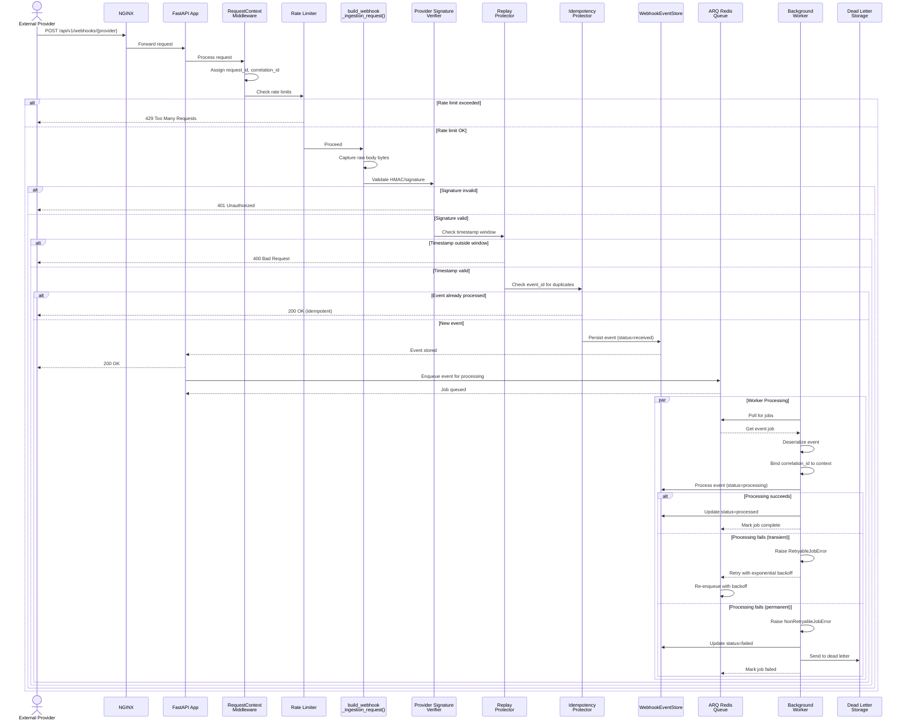
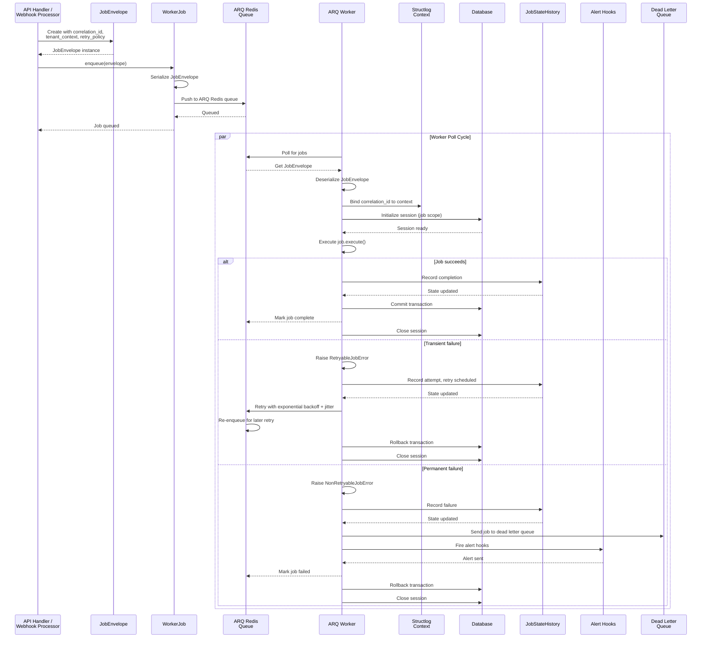
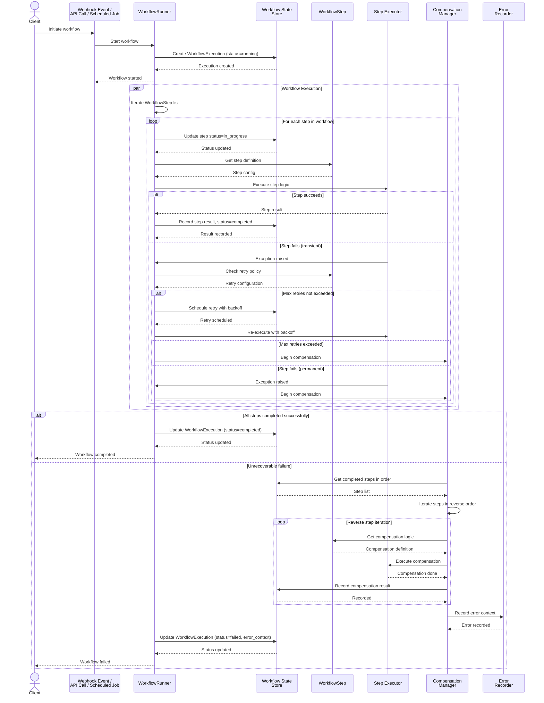
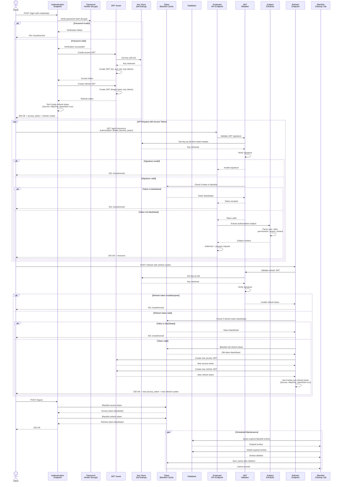

# Sequence Diagrams

This document illustrates the key flows in the FastAPI template application using Mermaid sequence diagrams. These diagrams show the interactions between components for critical operations.

---

## 1. Webhook Ingestion Flow

The webhook ingestion pipeline provides a robust, idempotent mechanism for receiving and processing external events. It includes signature verification, replay protection, and deduplication to ensure data integrity. Events are persisted immediately and processed asynchronously via a background job queue.

**Key Features:**
- Request context tracking (request ID, correlation ID)
- Provider-specific HMAC/signature verification
- Configurable replay window protection
- Idempotency via event deduplication
- Immediate acknowledgment to provider
- Asynchronous event processing with retry logic
- Dead-letter handling for failed events

---

## 2. Background Job Execution Flow

The background job execution system handles asynchronous work with full context preservation, comprehensive error handling, and automatic retry logic. Jobs are enqueued with correlation context to maintain observability across distributed operations.

**Key Features:**
- Context-aware job execution (correlation ID, tenant context)
- Configurable retry policies with exponential backoff and jitter
- Transient vs. permanent failure handling
- Job state tracking and history
- Dead-letter queue for unrecoverable failures
- Alert hooks for failures
- Database session lifecycle management

---

## 3. Workflow Orchestration Flow

The workflow orchestration system enables complex multi-step operations with retry logic, compensation (rollback) capabilities, and comprehensive state tracking. Workflows can be triggered by webhooks, API calls, or scheduled jobs and maintain full visibility into execution progress.

**Key Features:**
- WorkflowExecution state tracking
- Sequential step execution with result recording
- Per-step retry policies
- Compensation steps for rollback on failure
- Comprehensive error context
- Status transitions (running → completed/failed)
- Step-level result persistence

---

## 4. Authentication and Token Lifecycle

The authentication system provides secure JWT-based token management with short-lived access tokens, persistent refresh tokens, and token rotation. Password verification uses bcrypt with configurable work factors, and all tokens are tracked in a blacklist for immediate revocation.

**Key Features:**
- Password hashing with bcrypt (configurable rounds)
- JWT access tokens with key ID (kid) headers
- Refresh token rotation with automatic blacklist
- HttpOnly, Secure, SameSite cookie policies
- Token blacklist for revocation
- Subject extraction (user, roles, permissions, tenant)
- Automatic blacklist cleanup via scheduled jobs

---

## Implementation Notes

### Webhook Ingestion Flow
- **Request Context**: `RequestContextMiddleware` automatically assigns unique `request_id` and `correlation_id` to track requests through the system
- **Signature Verification**: Raw request body bytes are captured before parsing to ensure HMAC verification uses identical bytes to the provider's signature
- **Replay Protection**: Configurable via `WEBHOOK_REPLAY_WINDOW_SECONDS` environment variable
- **Idempotency**: Event deduplication prevents duplicate processing of the same webhook payload
- **Asynchronous Processing**: Fast acknowledgment to provider decouples ingestion from processing, improving reliability

### Background Job Execution Flow
- **Context Preservation**: Correlation IDs and tenant context are bound to structured logging context for full observability
- **Error Classification**: Jobs distinguish between transient errors (retryable) and permanent errors (fail-fast)
- **Exponential Backoff**: Retry timing uses exponential backoff with jitter to prevent thundering herd
- **Dead Letter**: Unrecoverable failures are sent to dead-letter queue with alert notifications

### Workflow Orchestration Flow
- **Compensation Steps**: Failed steps trigger reverse-order compensation for automatic rollback
- **Step Retries**: Each step can have independent retry policies separate from the overall workflow
- **State Persistence**: All step results and workflow state are persisted for auditability
- **Error Context**: Comprehensive error information is recorded for debugging and monitoring

### Authentication and Token Lifecycle
- **JWT Structure**: Access tokens include `kid` (key ID) header for key rotation support without downtime
- **Token Claims**: Tokens include standard claims (`iss`, `aud`, `exp`) plus custom subject claims
- **Cookie Security**: Refresh tokens are stored in `HttpOnly`, `Secure`, `SameSite=Lax` cookies to mitigate XSS
- **Token Rotation**: Refresh operations issue both new access and refresh tokens with automatic rotation
- **Blacklist Cleanup**: Expired blacklist entries are automatically pruned by scheduled maintenance job
